<div align="center">

# 🏢 Enterprise Resource Automation Pipeline

### *Intelligent Uniform Management System for IKEA*


**[View Demo](#usage) · [Report Bug](#contact) · [Documentation](#getting-started)**

</div>

---

## 🎯 What is This?

An **end-to-end automation framework** that transforms **manual uniform management** into a seamless, intelligent workflow.

### The Impact
<table>
<tr>
<td align="center">
<h3>⏱️</h3>
<b>Processing Time</b><br/>
Days → Minutes
</td>
<td align="center">
<h3>💯</h3>
<b>Stock Availability</b><br/>
100% Success Rate
</td>
<td align="center">
<h3>📧</h3>
<b>Automation</b><br/>
Fully Automated
</td>
<td align="center">
<h3>📊</h3>
<b>Real-time</b><br/>
Live Inventory
</td>
</tr>
</table>

---

## 🏗️ Architecture


### How It Works

```mermaid
graph LR
    A[📝 Employee Request] --> B[✅ Stock Check]
    B -->|In Stock| C[👔 Manager Approval]
    B -->|Out of Stock| D[❌ Notify Employee]
    C -->|Approved| E[📦 Queue for Issuance]
    C -->|Rejected| D
    E --> F[✉️ Weekly HR Report]
```



---

## ✨ Key Features

<table>
<tr>
<td width="50%">

### 🔄 **Automated Workflow**
- Google Forms intake
- Real-time stock validation  
- Auto-routing based on availability

</td>
<td width="50%">

### 👨‍💼 **Smart Approvals**
- One-click email approvals
- Interactive webhooks
- Instant notifications

</td>
</tr>
<tr>
<td width="50%">

### 📦 **Inventory Control**
- Live stock tracking
- Reserved quantity management
- Transaction audit logs

</td>
<td width="50%">

### 📊 **Reporting**
- Weekly HR digests
- Status tracking
- Complete audit trail

</td>
</tr>
</table>

---

## 💾 Database Design

<details>
<summary><b>📊 View Database Schema</b></summary>

<br/>


### Tables

| Table | Purpose | Key Fields |
|-------|---------|------------|
| **`inventory`** | Stock levels | `sku`, `size`, `on_hand_qty`, `reserved_qty` |
| **`requests`** | Uniform requests | `employee_name`, `status`, `sku`, `quantity` |
| **`transactions`** | Audit trail | `direction` (IN/OUT), `quantity`, `occurred_at` |


</details>

---

## 📧 Email Automation

<table>
<tr>
<td width="50%">

### Manager Approval


</td>
<td width="50%">

### Employee Notification


</td>
</tr>
</table>

---

## 🚀 Quick Start

### Prerequisites

```bash
# Install n8n
npm install n8n -g
# OR use Docker
docker run -it --rm -p 5678:5678 n8nio/n8n
```

**You'll also need:**
- 🗄️ [Supabase](https://supabase.com/) account
- 📧 Gmail API credentials
- 📊 Google Sheets access

### Installation

1️⃣ **Clone the repo**
```bash
git clone https://github.com/yourusername/Enterprise-Resource-Automation-Pipeline.git
cd Enterprise-Resource-Automation-Pipeline
```

2️⃣ **Set up database**
```sql
-- Run in Supabase SQL Editor
CREATE TABLE inventory (
  id SERIAL PRIMARY KEY,
  sku TEXT NOT NULL,
  size TEXT NOT NULL,
  on_hand_qty INTEGER DEFAULT 0,
  reserved_qty INTEGER DEFAULT 0,
  fit_type TEXT,
  color TEXT
);

CREATE TABLE requests (
  id UUID PRIMARY KEY DEFAULT gen_random_uuid(),
  employee_name TEXT,
  employee_email TEXT,
  manager_email TEXT,
  sku TEXT,
  size_requested TEXT,
  quantity SMALLINT,
  status TEXT DEFAULT 'Requested',
  requested_at TIMESTAMPTZ
);

CREATE TABLE transactions (
  id SERIAL PRIMARY KEY,
  request_id UUID REFERENCES requests(id),
  sku TEXT,
  direction TEXT,
  quantity INTEGER,
  occurred_at TIMESTAMPTZ DEFAULT NOW()
);
```

3️⃣ **Import workflow**
- Open n8n → Import from File
- Select `Uniform - Intake and Manager Approval.json`
- Configure credentials (Supabase, Gmail, Google Sheets)

4️⃣ **Activate** 🎉

---

## 📖 Usage

### For Employees
1. Fill out Google Form
2. Receive confirmation email
3. Wait for manager approval

### For Managers
- Click **Approve** or **Reject** in email
- Employee gets instant notification

### For HR
- Receive weekly distribution list
- Click "Mark Issued" to update inventory

---

## 🛠️ Built With

| Technology | Purpose |
|------------|---------|
| [n8n](https://n8n.io/) | Workflow automation engine |
| [Supabase](https://supabase.com/) | PostgreSQL database & APIs |
| [Google Sheets](https://sheets.google.com/) | Form response collection |
| [Gmail API](https://developers.google.com/gmail/api) | Email notifications |
| Webhooks | Interactive user responses |

---

## 🗺️ Roadmap

- [ ] Multi-location inventory support
- [ ] Advanced analytics dashboard (Power BI)
- [ ] Mobile app for requests
- [ ] AI-powered size recommendations
- [ ] Automated reordering system
- [ ] Slack/Teams integration

---

## 📄 License

Distributed under the MIT License. See `LICENSE` for more information.

---

## 📧 Contact

**Nirmit Khurana** · nirmitkhurana82@gmail.com

**Project Link:** [github.com/yourusername/Enterprise-Resource-Automation-Pipeline](https://github.com/yourusername/Enterprise-Resource-Automation-Pipeline)

---

<div align="center">

### 🙏 Acknowledgments

Built with [n8n](https://n8n.io/) · [Supabase](https://supabase.com/) · [Best-README-Template](https://github.com/othneildrew/Best-README-Template)

**⭐ Star this repo if you found it helpful!**

</div>
